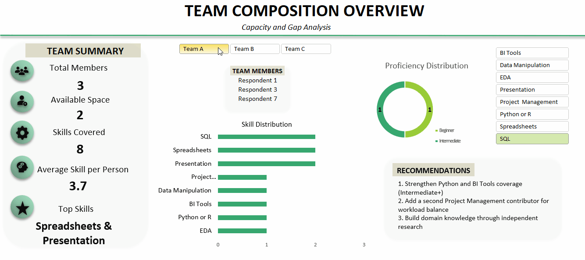
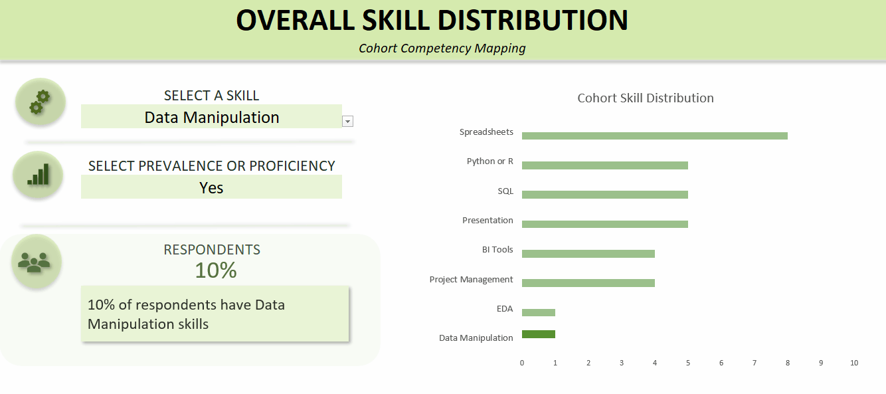

# Skill_Balanced_Team_Formation
A data-driven project that treated datathon team formation as an analytical problem: could a structured process build more balanced teams than random assignment?

---

## Why this project

When I put out a request for teammates, 10 people responded, making me the 11th person in the pool. Rather than assigning people to teams as they joined, I wanted to understand whether the available skills could be distributed more deliberately.

The project therefore treated team formation as a data problem: analyse the respondent skill profiles, identify areas of concentration and scarcity, and form teams that avoided excessive clustering of the same skills.

Because I was both the project owner and one of the respondents, fairness and potential self-assignment bias were also treated as explicit considerations. The process included predefined classification rules, an anti-concentration principle, direct clarification of contradictory responses, and independent verification of the final team distribution.

> This was a voluntary, independent initiative and was not officially affiliated with, endorsed by, or conducted on behalf of Women In Data or the datathon organisers. Final team registration remained the responsibility of the participants through official channels.

---

## Skills demonstrated

- **Data cleaning & validation** — deduplication, consistency checks, rule-based classification, contradiction resolution, and PII separation
- **Data transformation / ETL** — Power Query for wide-to-long transformation and query merging
- **Exploratory Data Analysis** — PivotTables, PivotCharts, skill prevalence, proficiency depth, scarcity, and coverage analysis
- **Excel analysis** — `IF`, `IFS`, `AVERAGE`, `SWITCH`, `COUNTIF`, `COUNTIFS`, and other formula-based calculations
- **Dashboard design** — interactive Excel dashboards using slicers, data-validation controls, PivotTables, and formula-driven outputs
- **Manual, rule-guided team formation** — skill-based grouping within a fixed 2–5 member team-size constraint
- **Bias safeguards** — explicit measures to reduce skill concentration and potential self-assignment bias
- **Data storytelling** — translating analysis into team-specific findings and targeted recruitment recommendations
- **Technical documentation** — documented methodology, EDA, verification, limitations, and recommendations

---

## Tools & tech stack

`Microsoft Excel` · `Power Query (M)` · `PivotTables` · `PivotCharts` · `Slicers` · `Data Validation` · `Excel Formulas`

---

## Project process

### 1. Collect

Three WhatsApp polls were used to collect:

- Tools & Languages — Spreadsheets, SQL, Python/R, and BI Tools
- Additional Skills & Expertise — Data Cleaning & Manipulation, EDA, Domain Knowledge, Project Management, and Presentation
- Absolute Beginner / Upskilling status

A late-joiner version of the polls was issued to members who joined after the initial collection.

The original pool contained 11 people. One confirmed non-responder was excluded, leaving **10 eligible respondents** for analysis.

### 2. Clean & validate

The responses were manually transferred into an Excel working dataset and then cleaned and validated.

Key steps included:

- Assigning pseudonymous Respondent IDs
- Separating contact information from the analytical dataset
- Checking for duplicate records
- Standardising entries and predefined categories
- Applying rule-based Absolute Beginner classification
- Reviewing contradictory responses
- Resolving genuine contradictions through direct respondent clarification
- Treating `Actively Upskilling` as an interpretive status rather than a scored skill
- Removing the unused `Unique Skills` field after confirming that no respondent selected it

### 3. Transform

Power Query was used to prepare the dataset for analysis and dashboarding.

The respondent-level data was reshaped from **wide to long format**, making skill-level analysis and PivotTable-based counting more efficient. Queries were also merged to support the interactive dashboard.

### 4. Analyse

Exploratory analysis examined:

- Overall skill distribution
- Proficiency depth
- Skill prevalence
- Skill scarcity
- Coverage gaps
- Distribution of analytical and supporting skills

The analysis distinguished between **analysis skills** and **supporting skills**, rather than treating every skill as directly equivalent.

### 5. Form teams

Respondents were grouped manually using their full skill profiles rather than reducing each person to a single score.

The process used:

- Skill-pool analysis
- An anti-concentration principle
- Strategic placement of scarce capabilities
- Targeted swaps to reduce skill concentration
- The required 2–5 member team-size constraint

The final structure consisted of **three teams of 3, 4, and 3 respondents**.

### 6. Verify

The final team composition was independently checked using Excel PivotTables and multiple formulas, including `COUNTIF`/`COUNTIFS` alongside other formula-based calculations.

The verification confirmed that the final team distribution met the project's defined **maximum-spread-of-one balance standard**.

EDA and Data Manipulation were treated separately as coverage limitations because each skill was held by only one respondent in the full dataset.

---

## Key findings

| Finding | Result |
|---|---|
| Most prevalent skill | **Spreadsheets — 8 of 10 respondents** |
| Most evenly distributed proficiency-based analysis skill | **SQL — 3 Beginner, 2 Intermediate** |
| Scarcest non-zero skills | **EDA and Data Manipulation — 1 respondent each** |
| Largest apparent coverage gap | **Domain Knowledge — 0 of 10 respondents** |
| BI Tools proficiency depth | **4 respondents, all Beginner** |
| Python/R proficiency depth | **5 respondents, including only 1 Intermediate** |
| Advanced proficiency | **None reported** |

The findings showed that respondent count alone was not enough to understand the available capability. Proficiency depth and skill scarcity also affected how respondents could be distributed across teams.

---

## Results — final team structure

| Team | Size | Open Slots |
|---|---:|---:|
| Team A | 3 | 2 |
| Team B | 4 | 1 |
| Team C | 3 | 2 |

The final teams met the project's defined balance standard: for each skill, the difference in respondent counts between teams did not exceed one.

This standard measured **distribution of available capability**, not identical team profiles or complete self-sufficiency.

Each team also received targeted recommendations based on its remaining capability gaps and workload concentration.

---

## Team recommendations

The final teams met the defined balance standard, but balance did not mean complete self-sufficiency.

Recommendations were therefore focused on **capability strengthening and workload management**, rather than correcting an unbalanced team structure.

### Team A

- Recruit **Intermediate+ Python and BI Tools** capability
- Add a second Project Management contributor for workload backup
- Build Domain Knowledge through independent research

### Team B

- Recruit a member who can perform **EDA and Data Manipulation using SQL or Python at Intermediate+ level**
- Use the single open position to address the team's most significant analytical gap
- Develop Domain Knowledge through independent research

### Team C

- Recruit **Intermediate+ EDA and Data Manipulation capability using SQL or Python**
- Strengthen BI Tools capability at Intermediate+ level
- Build Domain Knowledge through independent research

The recommendations were deliberately team-specific rather than based on a single checklist applied to every team.

---

## Interactive dashboard

The Excel dashboard contains **two interactive views**:

### Dashboard 1 — Team Composition Overview

An interactive team-level view showing team composition, team size, skill distribution, and respondent-level information.

### Dashboard 2 —  Overall Skill Distribution

An interactive overview for exploring the respondent skill pool and proficiency distribution.

[Team Formation Dashboard](03_Dashboards/Team_Formation_Dashboard.xlsx)

---

## Fairness & bias safeguards

Because the project owner was also a respondent, potential self-assignment bias was explicitly considered.

Safeguards included:

- Separating the strongest analytical profiles across different teams
- Applying an anti-concentration principle rather than making a one-off placement decision
- Assigning an unpaired analytical position using an objective skill-breadth criterion rather than project ownership
- Resolving genuine data contradictions through direct respondent clarification
- Avoiding assumptions about respondent capabilities where clarification was possible
- Independently verifying the final team distribution
- Keeping respondent contact information separate from the analytical dataset
- Disclosing from the outset that the initiative was voluntary and independent of Women In Data

---

## Limitations

- **Small, self-reported sample:** Analysis covers 10 respondents; proficiency was self-reported, not independently assessed, and general analytical reasoning wasn't captured as its own skill.
- **Coverage gaps:** Domain Knowledge's zero result may reflect poll wording rather than true absence; EDA and Data Manipulation stayed scarce because only one respondent held either, so no redistribution could fix it.
- **Manual method:** Grouping suited this small pool but would need a more formal optimisation approach at larger scale.
- **Unverified outcomes:** Recommendations name target capability profiles per team but don't confirm whether matching recruits were actually found.

---

## Full documentation

The full project report contains the detailed methodology, data preparation process, EDA, team-formation logic, verification, recommendations, and limitations.

[Team Formation Analysis](04_Reports/Team_Formation_Analysis.docx)

---

*Built independently for the 2026 Women In Data Datathon community. This was not an official Women In Data deliverable.*
